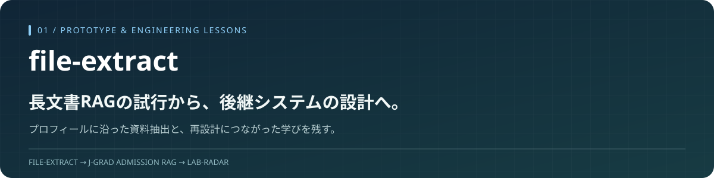

<p align="center"></p>

# file-extract

**日本の大学院募集要項を対象に、申請者の条件に沿って根拠を選び、構造化JSONとレポートに変換する初期RAGプロトタイプです。**

自然言語QAを実装する過程で、モデルに渡せる情報量、処理時間、API利用コストの課題に直面しました。部分的な機能追加ではなく構成を見直すため、後継の **[J-Grad-Admission-RAG](https://github.com/yasu-isct/J-Grad-Admission-RAG)** を新たに設計しました。本リポジトリは、その前段の実装と試行錯誤を残す技術ポートフォリオです。

> **位置付け：初期の技術探索。主開発はJ-Gradへ移行しています。**
> PDF処理・証拠選択・LLM抽出・レポートの実装を含みます。対話サービスの完成版ではありません。最新の教務支援デモは後継リポジトリを参照してください。

## どのような問題から始めたか

日本の大学院募集要項は長く、学系や選抜方式によって条件が異なります。RAGの学習を出発点に、「関係する箇所だけを取り出し、申請者に必要な情報を整理できないか」と考えて開発しました。

初期の抽出・レポート作成を進めた後、自然言語で質問できる形への拡張を試みました。その段階で、長い資料の文脈を保つことと、対話に適した応答時間・コストを両立する難しさが明確になりました。

## 実装した処理

```text
募集要項PDF + 申請者プロフィール
  → 本文・表・ページの抽出
  → chunk化とプロフィールに沿った候補選択
  → n-gram / ローカル埋め込みによる検索・参照先の補足
  → カテゴリ単位のLLM抽出
  → JSONの統合・検証
  → 適用性の整理・Markdownレポート
```

| 領域 | リポジトリにある実装 | 読みどころ |
| --- | --- | --- |
| PDF処理 | PyMuPDF / pdfplumberによる本文・表の抽出、chunk化 | [extractor](src/admission_parser/extractor.py) / [chunker](src/admission_parser/chunker.py) |
| 候補選択 | 申請先・学位・英語試験等に沿ったcursor選択、検索による補足 | [evidence selector](src/admission_parser/evidence_selector.py) / [retriever](src/admission_parser/vector_retriever.py) |
| 文書内参照 | 「下記(1)」等の参照を解決し、直接・再帰的に補足 | [reference resolver](src/admission_parser/reference_resolver.py) / [recursive retriever](src/admission_parser/recursive_retriever.py) |
| 構造化抽出 | カテゴリ別schema、batch化、並列呼出し、抽出cache | [LLM parser](src/admission_parser/llm_parser.py) |
| レポート | JSON統合、検証、プロフィールに応じた適用性整理、文章化 | [pipeline](src/admission_parser/profile_pipeline.py) / [reporter](src/admission_parser/reporter.py) |
| 診断 | 候補chunkと検索結果をHTML / JSONで比較 | [cross-check](src/admission_parser/retrieval_crosscheck.py) / [tests](tests) |

旧版にはLLMによる適用性整理が含まれます。後継J-Gradのレビュー済みルールによる条件判定と、同じ保証を持つものではありません。

## 実験から分かったこと

[実験記録](docs/experiments/2026-05-25_run_baseline_and_optimizations.md)には、後継設計につながる観察が残っています。

| 観察 | 設計への示唆 |
| --- | --- |
| あるAPI抽出実験では、候補を30 chunkに絞っても一連の処理に407.4秒を要した | 検索候補を減らすだけでは、対話の応答時間を解決できない |
| top-kだけで絞った結果、重要な文脈が抜け、レポート品質が低下した | 類似度に加えて、対象範囲と参照関係を保持する必要がある |
| 52 chunkを逐次呼び出す方式から、カテゴリ別batchにすると呼出し見積りが8回になった | 呼出し回数と並列化は重要。ただしtoken消費が同じ比率で減るわけではない |
| 同じPDFでもプロフィール変更のたびに処理を繰り返しやすい | 文書共通の前処理・知識と、個人条件の照合を分けるべき |

数値は当時の固定資料・設定における記録です。今回再計測したものではなく、407.4秒はベクトル類似度計算だけの時間ではありません。52→8もdry-runでの呼出し見積りであり、課金額削減率ではありません。

## なぜJ-Gradを別に設計したか

| この原型での課題 | 後継で取り組んだ設計 |
| --- | --- |
| 長文書処理とユーザーへの回答が密接につながっていた | 重い資料構築と、既存資産を使う照会を分離 |
| cacheと文書版の管理が実験単位だった | PDF・KB・索引・モデル版を明示的な識別情報で管理 |
| 検索結果から条件を判断する過程が不安定だった | 検索候補、レビュー済み条件、自然言語の参考回答を分離 |
| 最終文章だけでは問題箇所が分かりにくかった | 原文・ページ・適用範囲と、検証記録を保持 |

単純なモデル交換ではなく、何を事前計算し、何を問い合わせ時に行うかを見直したことが、後継への移行の中心です。コードの全てがそのまま移植されたことや、同一条件で性能差を実証したことを意味しません。

## 手元で処理を確認する

Python 3.10以上。以下はPowerShellの例です。

```powershell
git clone https://github.com/yasu-isct/file-extract.git
cd file-extract
python -m venv .venv
.\.venv\Scripts\Activate.ps1
python -m pip install -e ".[dev]"
python -m pytest
```

ローカルに用意したPDFで、LLMを呼ばずに候補選択を確認する例：

```powershell
python -m admission_parser.profile_pipeline samples\2027_4_2026_9_master.pdf `
  --profile-config configs\applicant_profile.example.yaml `
  --dry-run --page-scope all --retrieval-mode hybrid `
  --retrieval-backend ngram --retrieval-source cursor `
  --top-k 30 --reference-expansion direct `
  --run-dir outputs\runs\profile_dry_run
```

このngramのdry-runにモデルや有料APIは不要です。PDFとPython依存は別途必要です。選択chunkや検索診断を見てから、必要な場合だけLLM抽出を設定します。

ローカル埋め込みは追加の `.[embedding]` 依存とモデルを使用します。LLMを使う処理は `.env.example` を参考に設定し、料金と送信する資料範囲を確認してください。APIキー・PDF・モデル・実行結果を不用意にコミットしないでください。

## 技術・開発資料

- **実装：** Python / PyMuPDF / pdfplumber / Pydantic / Instructor / OpenAI SDK。ローカル埋め込みはSentence Transformersを任意で利用。
- **検証：** pytest、検索比較用HTML、段階別JSON、実験ログ。最新のテスト件数・モデル品質を、この紹介更新で測定したものではありません。
- **開発：** 生成AIのコーディング支援を利用。課題設定、処理の切り分け、失敗の分析、後継の設計判断を含めて記録しています。

[当時の構成](docs/architecture.md) · [当時の製品構想](docs/product_mainline.md) · [当時のロードマップ](docs/roadmap.md) · [変更履歴](CHANGELOG.md)

既存資料の「次の開発」は当時の計画です。現在の主開発を示すものではありません。

## プロジェクトのつながり

**file-extract：長文書処理の探索** → **[J-Grad：教務支援への発展](https://github.com/yasu-isct/J-Grad-Admission-RAG)** → **[Lab-Radar：研究室検索の拡張構想](https://github.com/yasu-isct/Lab-Radar)**

後継J-Gradは留学塾の教務支援システムの公開デモです。本リポジトリ自体を塾内業務版として提供しているという意味ではありません。
